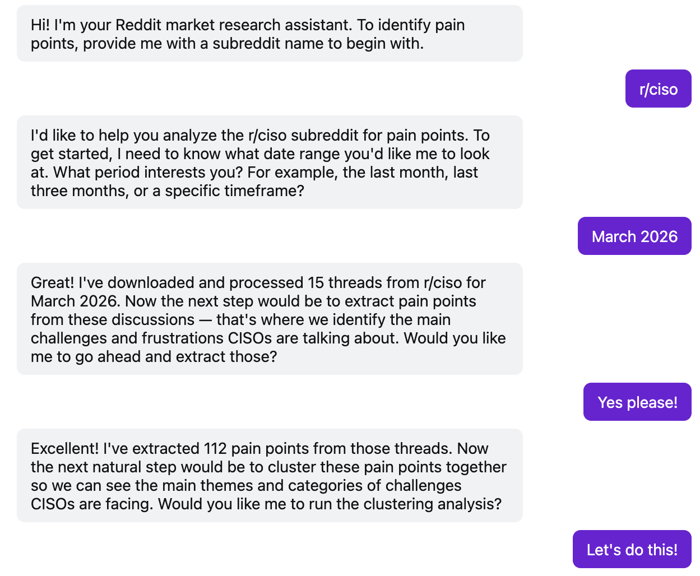
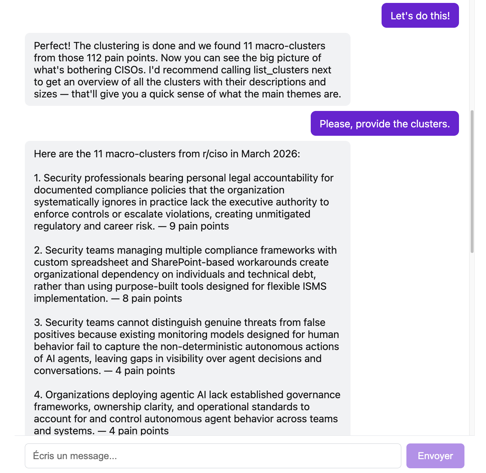
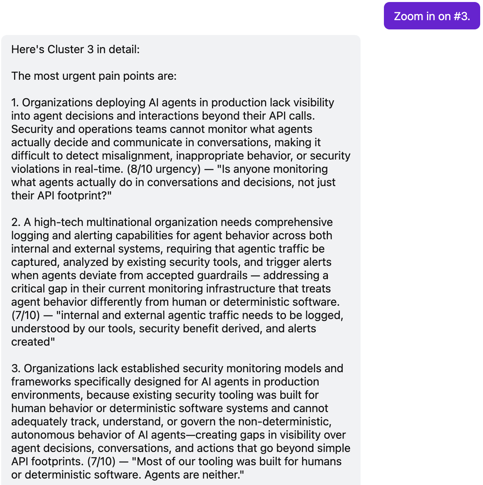

# Reddit Pain Point Extractor

A market research tool that downloads Reddit threads, extracts pain points using LLMs, clusters them semantically, and lets you explore the results through a conversational chat interface.

**Data source:** [arctic-shift.photon-reddit.com](https://arctic-shift.photon-reddit.com)

---

## Demo

Download a subreddit, extract pain points, cluster them, and explore results — all through a conversational interface.







---

## Getting started

### Prerequisites

- Python 3.12
- Node.js 22
- Copy `.env_template` to `.env` and fill in the missing API keys

### Frontend

```bash
cd frontend
npm run dev
```

### Backend

```bash
cd backend
uv run --env-file ../.env fastapi dev src/main.py
```

---

## Concepts

**Pain point** — a specific frustration, obstacle, or unmet need expressed by a user in a Reddit thread. It is extracted verbatim from the discussion and then reformulated into a concise, actionable statement, with an urgency score (1–10) reflecting how acutely the person feels the problem.

**Cluster** — a group of pain points that share the same root cause. Clustering surfaces recurring themes across individual complaints: instead of reading every quote, you see "10 people struggle with the same onboarding gap" as a single entry, ranked by how many people it affects.

---

## Architecture

The system is split into a React frontend and a FastAPI backend. The backend orchestrates a multi-step LLM pipeline through a conversational ReAct agent.

```
React UI → FastAPI → LangGraph ReAct agent → tools → ThreadsManagerService (pickle state)
                                                    → PPExtractorWorkflow (Pain points extraction)
                                                    → ClusterBuilderWorkflow (Pain points clustering)
```

The agent guides the user through the pipeline step by step: download a subreddit, extract pain points, filter by urgency, cluster, and explore results.

---

## Backend (`backend/src/`)

### Entry point & routing

| File | Description |
|------|-------------|
| `main.py` | FastAPI app — mounts the `/chat` router |
| `routers/chat.py` | HTTP routes: `POST /conversations` (create) and `POST /conversations/{id}/messages` (send) |
| `services/chat_service.py` | Thin wrapper — `create_conversation()` returns a UUID + greeting; `agent_send_message()` delegates to the agent |
| `core/llm.py` | `get_llm()` factory — loads `claude-haiku-4-5` via LangChain `init_chat_model`; single shared model across all agents |

### Shared types (`schemas/schema.py`)

| Type | Description |
|------|-------------|
| `PainPoint` | Core output unit — `verbatim`, `pain_point_reformulated`, `urgency` (1–10), `post_id` |
| `PainSummary` / `PostPainSummary` | Intermediate structured LLM output for the thread scan step |
| `Comment` | TypedDict for the recursive comment tree (`text`, `sub_comments`) |
| `MacroCluster` | Final cluster — `description` + list of `PainPoint` |

### `ThreadsManagerService` (`services/threads_manager.py`)

The central service that encapsulates the entire pipeline. State is pickle-serializable so each pipeline step can be saved and resumed independently.

| Method | Description |
|--------|-------------|
| `download_subreddit()` | Paginates the Arctic Shift API with rate limit handling |
| `ingest_posts()` / `ingest_comments()` | Field selection + normalization; comments shorter than 50 chars are discarded |
| `build_threads()` | Assembles post→comments trees sorted by score; threads with score < 3 are dropped |
| `extract_pain_points()` | Delegates to `PPExtractorWorkflow` |
| `filter_pain_points()` | Filters pain points by urgency threshold (default 6/10) |
| `spot_clusters()` | Delegates to `ClusterBuilderWorkflow` |
| `flatten_dataset()` | Flattens clusters into a list of dicts for LangSmith export |
| `stats()` | Prints pipeline metrics (threads, comments, pain points, clusters) |

---

## Agents (`agents/`)

### Pain point extractor (`pp_extractor.py`)

`PPExtractorWorkflow` — two-level nested LangGraph workflow.

**Outer graph** — breadth layer. Spawns one inner graph per thread and runs them all in parallel. Its only job is fan-out and result aggregation: it does not read thread content itself.

**Inner graph** — depth layer. One instance per thread. Responsible for fully processing a single thread end-to-end: first identifying what pain points exist, then extracting each one in detail.

```
thread_scanner → pain_deduplicator → spawn_pain_workers → pain_point_extractor (×N)
```

1. **`thread_scanner`** — one LLM call that reads the full thread and returns a list of 10-word pain point descriptions (index + label)
2. **`pain_deduplicator`** — LLM pass that collapses near-duplicate descriptions before spawning workers, keeping the list tight
3. **`spawn_pain_workers`** — fans out one worker per deduplicated pain point
4. **`pain_point_extractor`** — one LLM call per pain point to extract `verbatim`, `pain_point_reformulated`, and `urgency`

All nodes use an infinite `RetryPolicy` on rate-limit errors (exponential backoff). Post-deduplication by exact verbatim keeps the highest-urgency entry.

### Cluster builder (`pp_cluster_builder.py`)

`ClusterBuilderWorkflow` — hierarchical LLM + embedding clustering.

```
pick_and_filter (loop) → describe_clusters → consolidate → reflect_consolidation
```

| Phase | Description |
|-------|-------------|
| **pick_and_filter** (loop) | Picks the current pivot, finds 15 nearest neighbors via ChromaDB (cosine, `nomic-ai/nomic-embed-text-v1.5`), submits to a strict LLM to validate true duplicates → micro-cluster. Loops until all pain points are consumed. |
| **describe_clusters** | LLM describes each micro-cluster in one precise sentence capturing the specific failure, not just the topic |
| **consolidate** | LLM groups micro-clusters into macro-categories (top 15 by size) |
| **reflect_consolidation** | LLM audits each proposed macro-group and re-partitions members that don't truly share the same root cause |

Output: list of `MacroCluster` sorted by descending size.

### Conversational agent (`main_agent/`)

`main_agent.py` — LangGraph ReAct agent with `MemorySaver` for per-`thread_id` persistence.

The system prompt adapts dynamically after each tool call (`_build_system_prompt`) to guide the agent's next response (e.g. recommend next pipeline step after a download, present clusters after clustering).

**Tools** (`tools.py`) — 8 LangChain tools, all operating on `backend/data/tmp/` pickles:

| Tool | Description |
|------|-------------|
| `build_user_thread` | Download + ingest + build threads for a subreddit + date range; saves state to a pickle |
| `list_tmp_files` | List available pickle files |
| `inspect_state` | Report what pipeline steps are already completed in a pickle |
| `extract_pain_points` | Run `PPExtractorWorkflow` on a pickle and save back |
| `filter_pain_points` | Filter pain points by urgency threshold and save back |
| `spot_clusters` | Run `ClusterBuilderWorkflow` on a pickle and save back |
| `list_clusters` | List all macro-clusters with descriptions and sizes |
| `get_cluster` | Return full details of a cluster — all pain points with verbatim quotes and urgency scores |

---

## Frontend (`frontend/src/`)

| File | Description |
|------|-------------|
| `main.tsx` | React bootstrap — mounts `<App />` |
| `App.tsx` | Root component — composes `<MessageList>` + `<ChatInput>` via the `useChat` hook |
| `types.ts` | `Message { role: 'user' \| 'assistant', content: string }` |
| `api/conversations.ts` | `createConversation()` and `sendMessage()` axios calls to the FastAPI backend |
| `hooks/useChat.ts` | Core UI hook — manages messages, input, loading state, auto-scroll, and submit logic |
| `components/ChatInput/` | Textarea form with a Send button |
| `components/MessageList/` | Message bubble renderer (user vs assistant) |

---

## Evaluations (`evals/`)

LangSmith-based evaluation suite for measuring clustering quality.

| File | Description |
|------|-------------|
| `datasets/export_dataset-*.py` | One-shot script — exports a pickle's flattened clusters to a LangSmith dataset |
| `datasets/dataset_stats.py` | Loads a pickle and prints pipeline metrics via `svc.stats()` |
| `evaluators/evaluators.py` | `cluster_assignment_judge` — LangSmith evaluator that scores (0/1) whether a pain point belongs to its assigned cluster |
| `experiments/run_pipeline_evals.py` | Runs `langsmith.evaluate()` on a named dataset and prints average score and correct-assignment count |

### Results — `(r/ciso, April 2026)`

Dataset: `backend/evals/datasets/ciso_2026-04-01_2026-04-30.pkl` 

**Dataset statistics**

| Metric | Value |
|--------|-------|
| Threads | 11 |
| Comments | 170 |
| Pain points extracted | 98 |
| Clusters | 10 |
| Pain points in clusters | 48 |
| Avg pain points / cluster | 4.8 |
| Min / Max cluster size | 3 / 8 |

The pipeline extracted 98 pain points from 11 threads, of which 48 were retained after clustering (3–8 members each).

**Offline clustering evaluation**

Experiment [`cluster-accuracy-efa496f6`](https://smith.langchain.com/o/a57b71fa-5b63-452b-a696-3a5b9f0b7550/datasets/531b1334-ae64-4435-b480-3054a74a6617/compare?selectedSessions=1003adbe-5bb9-4990-8697-2c1a12ed21e7) — run via `evals/experiments/run_pipeline_evals.py` against the LangSmith dataset.

| Metric | Value |
|--------|-------|
| Average score | **89.58 %** |
| Correctly classified | 43 / 48 |

Each of the 48 clustered pain points is judged independently by the `cluster_assignment_judge` LLM evaluator (0/1): does this pain point genuinely belong to its assigned cluster description? 43 out of 48 passed, meaning the `ClusterBuilderWorkflow` produces coherent, well-scoped clusters on this dataset with only 5 borderline assignments.

**Pipeline timings**

| Stage | Duration | Cost |
|-------|----------|------|
| `PPExtractorWorkflow` | 67 s | $0.13 |
| `ClusterBuilderWorkflow` | 85 s | $0.45 |

---

## Tests

```bash
cd backend
uv run pytest
```

Fixture data lives in `backend/tests/data/` — pre-computed JSONL/pickle files for unit tests that avoid running full LLM pipelines.

---

## Development commands

```bash
# Backend — from backend/
uv run --env-file ../.env fastapi dev src/main.py   # start API server
uv run pytest                                        # run all tests
uv run ruff check src/                               # lint

# Frontend — from frontend/
npm run dev                                          # start dev server
```
